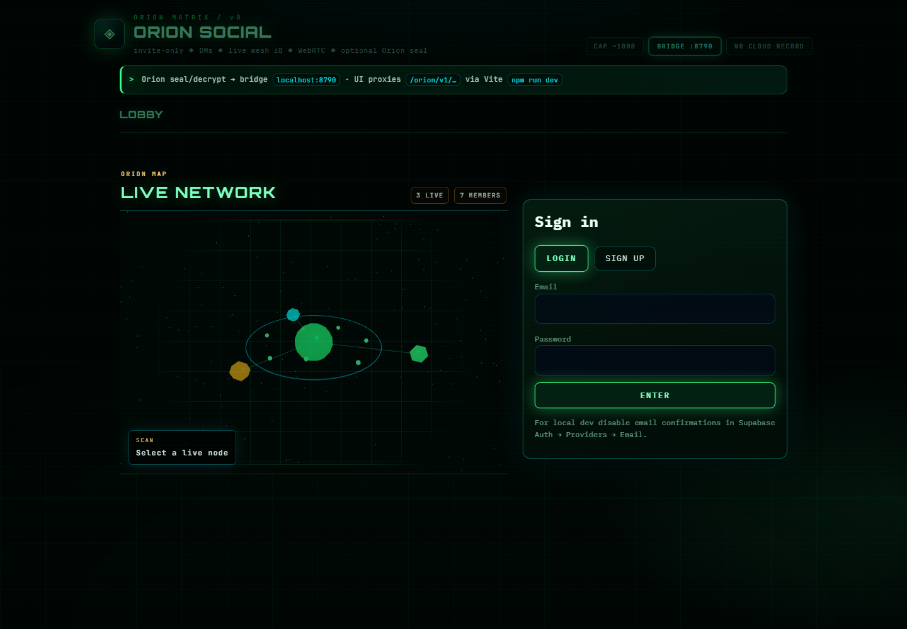
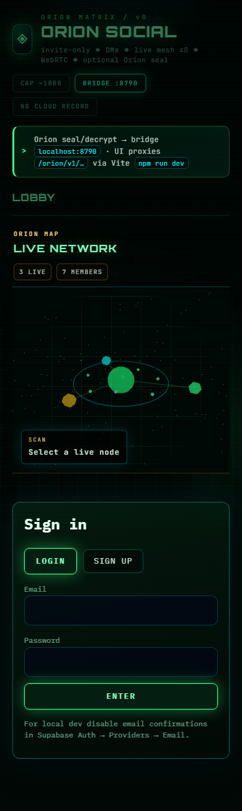

# Orion Social — Feature Spread

Invite-only social mesh. Cap ~1000. No cloud video recording. Optional Orion seal on DMs.

## Screenshots

*Desktop lobby — Orion Matrix UI, Live Network map, sign-in.*

*Mobile layout of the same lobby / map.*

## Feature map

### Live rooms (TikTok-style grid)
- Public browseable **Live** rooms
- Mesh **WebRTC** signaling over Supabase Postgres (no SFU video storage wired in)
- Up to **7 on-camera publishers** per room in a grid
- Host / mods, likes, leave/purge chat, bans & admin reclaim

### Battle Mode
- Team clash: **Alpha vs Omega** (plus Royale target mode)
- Animated **battle gifts** with score + **Godmode** meters (target 10)
- 20% battle discount · breakpoint surge · SFX (break / coin / eliminate / winner)
- Revenue split: **85% creator** / **15% network designers**
- Stripe checkout for gift packs
- League table: wins, points, latest win

### Gifts & avatars
TickTockPrime / Orion Key gift set (WebM under `web/public/gifts/`):

- Direct Snowball
- Golden Rose
- Nebula Ghost
- Void Sentinel
- Cipher Astronaut
- Quantum Fox
- Black-Hole Crown
- Geo-30 Lattice Mage
- Dual-Control Twin Keys
- Argon Pressure Titan
- Star-Tracker Owl
- Sealed Token Djinn
- Mars Horizon Pilgrim
- Cipher Seraph
- Pulse-Code Comet Rider
- Archive-Horizon Leviathan
- Brain-Secret Sphinx
- Orbit Ring Dancer
- StrongBox Beetle
- Null-Cipher Phantom
- Constellation Keysmith
- Assurance Throne Mythic
- Golden Lion King
- Diamond Orbit

### DMs + Orion seal
- Direct messages
- Optional **zero-server-secret sealing** (ephemeral secret + ECDH wrap to peers) via Orion Key bridge

### Live Network map
- Interactive **3D / orbital** live map of rooms & members
- Scan / select live nodes from the lobby

### Friends, rivalry, reels
- Friend hub + presence + friends-live rail
- Rivalry arcs
- Orion Reels feed + publish-from-live

### League & power
- Battle league standings
- Room power / like league

### Platforms
- Web (Vite + React)
- Desktop launcher packaging
- Android (Capacitor) / IPA build scripts

## Privacy stance
- **NO CLOUD RECORD** badge in UI
- Real keys stay in local `.env` — never in git
